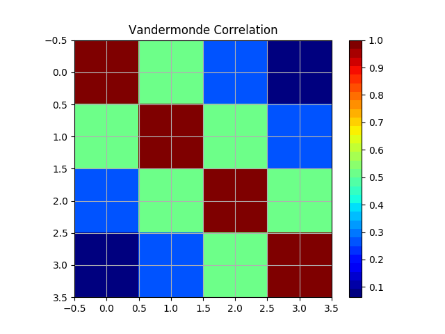
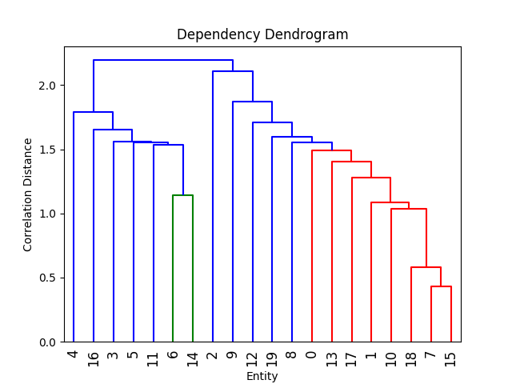

Intro
=========================

correlationMatrix is a Python powered library for the statistical analysis and visualization of correlation 
phenomena. It can be used to analyze any dataset that captures timestamped values (timeseries) 
The present use cases focus on typical analysis of market correlations, e.g., via factor models

You can use correlationMatrix to

- Estimate correlation matrices from historical timeseries using a variety of models
- Visualize correlation matrices
- Manipulate correlation matrices (stress matrices, fix problematic matrices etc)
- Provide standardized data sets for testing

Key Information
================

* Author: [Open Risk](http://www.openriskmanagement.com)
* License: Apache 2.0
* Mathematical Documentation: [Open Risk Manual](https://www.openriskmanual.org/wiki/Correlation_Matrix)
* Development website: [Github](https://github.com/open-risk/correlationMatrix)
* General Discussions: [Open Risk Commons](https://www.openriskcommons.org/c/open-source/correlationmatrix/26)

**NB: correlationMatrix is still in active development. If you encounter issues please raise them in our
GitHub repository**

Examples
========

The examples directory contains examples illustrating the current functionality

Display correlation matrix

Display dependency dendrogram

